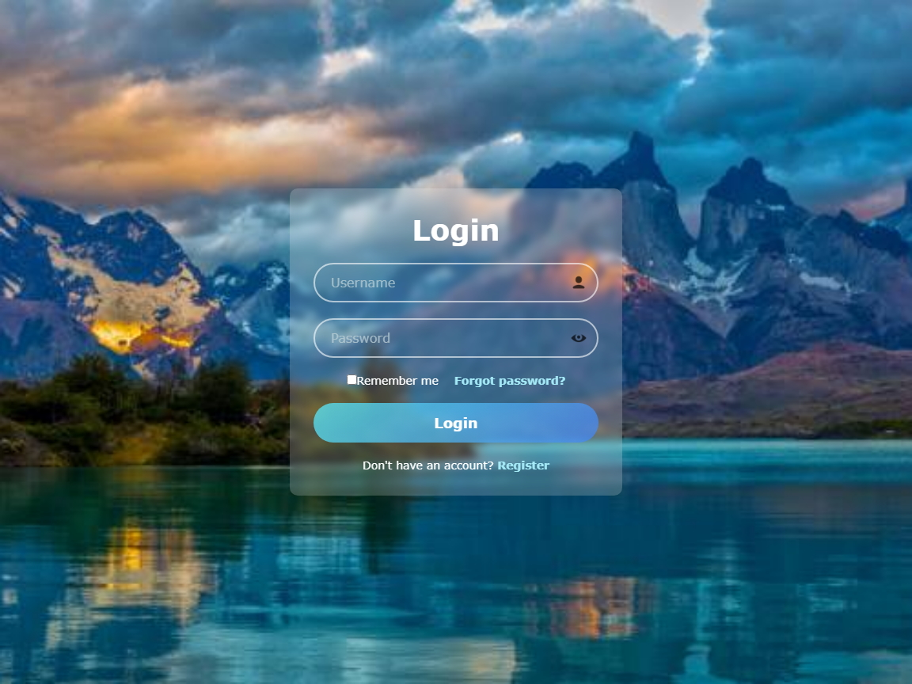

# 💎 Glassmorphism Login Form UI

A clean and modern login form built with **HTML**, **CSS**, and **JavaScript**, featuring a blurred glass-like background, password toggle visibility, and smooth animations.

---

## 🚀 Features

- ✨ Glassmorphism style with blurred background
- 🔒 Password show/hide toggle
- 🧼 Clean and responsive layout
- 🎨 Hover animations and styled placeholders
- ⚙️ Fully customizable and vanilla (no frameworks)

---

## 📁 Files Included

- `index.html` – main HTML structure  
- `style.css` – design & styling  
- `JavaScript.js` – interactivity (password toggle)  
- `preview.jpg` – form screenshot  
- `README.md` – this file  

---

## 🛠 How to Use

1. Download and unzip the files.
2. Open `index.html` in your browser.
3. You can edit text, colors, or layout in the HTML/CSS files as needed.

---

## 📱 Mobile Ready

Tested to look good on both desktop and mobile screens.

---

## 📜 License

This project is licensed for **personal and educational use only**.  
If you'd like to use it commercially or include it in a product, please contact the author.

---

## 🙌 Credits

Icons from [Icons8](https://icons8.com/)  
Background from [Freepik](https://www.freepik.com/)

---

## 💬 Contact

Feel free to reach out if you have questions or need help customizing!

